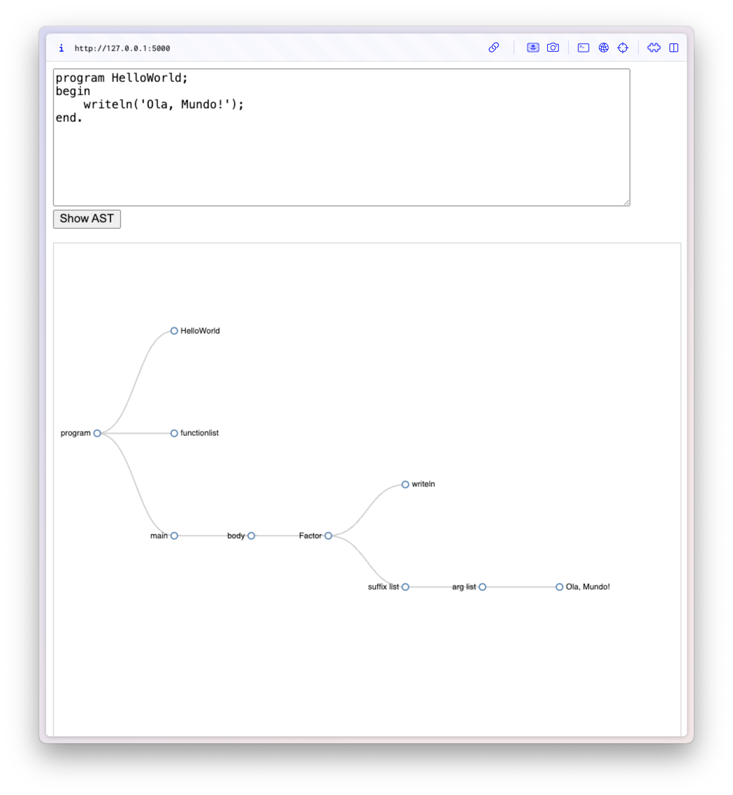

<h1 style="text-align: center">Processamento de Linguagens</h1>
<h3 style="text-align: center">Grupo 1</h1>
<p style="text-align: center">1 de junho de 2025</p>
<div style="text-align: center; display: flex; justify-content: space-around; margin: 4em 0em">
    <div>
        <div><b>Edgar Ferreira</b></div>
        <div>A99890</div>
    </div>
    <div style="margin-right: 18px;">
        <div><b>Eduardo Faria</b></div>
        <div>A104353</div>
    </div>
    <div>
        <div><b>Nuno Silva</b></div>
        <div>A104089</div>
    </div>
</div>

# Índice

- [Introdução](#introdução)
- [1. Analisador Léxico](#1-analisador-léxico)
- [2. Passagem Sintática](#2-passagem-sintática)
  - [2.1. Gramática Independente de Contexto](#21-gramática-independente-de-contexto)
  - [2.2. Analisador Sintático](#22-analisador-sintático)
- [3. Analisador Semântico](#3-analisador-semântico)
- [4. Tradutor](#4-tradutor)
- [5. Visualizador Árvore Sintática](#5-visualizador-árvore-sintática)
- [6. Conclusão](#6-conclusão)

# Introdução

Este relatório visa documentar e detalhar todo o processo de conceção do trabalho prático desenvolvido na unidade curricular de [Processamento de Linguagens](https://www.di.uminho.pt/~jno/sitedi/uc_J306N4.html). O fundamento deste trabalho é o desenvolvimento de um compilador capaz de analisar, interpretar e traduzir código Pascal (_standard_) para código máquina de forma direta ou indireta. Neste caso, optou-se por traduzir o código para um formato intermédio, a partir do qual se gerou, finalmente, o código máquina que será interpretado pela máquina virtual [EWVM](https://ewvm.epl.di.uminho.pt/).

## 1. Analisador Léxico

O primeiro passo do processo de compilação é a análise léxica, que consiste em transformar o código-fonte numa sequência de _tokens_, mediante um _lexer_. Para esta tarefa, utilizamos o módulo `lex` da biblioteca [ply](https://www.dabeaz.com/ply/ply.html), uma ferramenta amplamente utilizada nas aulas práticas, que nos facilitou a construção do analisador léxico.

Dada a natureza relativamente estruturada da linguagem _Pascal_, a implementação do _lexer_ foi bastante direta. Ainda assim procuramos seguir uma abordagem modular e robusta, antecipando possíveis extensões futuras.

O _lexer_ desenvolvido reconhece um conjunto alargado de literais, palavras reservadas e terminais variáveis:

```python
literals = ['(', ')', ';', '.', ',', ':', '{', '}', '>', '<', '=', '*', '+', '-', '/', '[', ']']
tokens = (
    'PROGRAM', 'VAR', 'BEGIN', 'END', 'IF', 'THEN', 'ELSE', 'FOR', 'TO', 'DO', 'WHILE', 'DIV', 'MOD', 'AND', 'OR', 'NOT', 'ARRAY', 'OF', 'DOWNTO', 'FUNCTION', 'PROCEDURE',
    'id', 'string', 'num', 'boolean'
)
```

Uma das decisões que tomamos foi tratar todas as palavras reservadas de forma _case-insensitive_, à semelhança do comportamento tradicional do _Pascal_.

Fazendo uso do `ply.lex`, e assegurando o reconhecimento dos padrões textuais através de expressões regulares, a "tokenização" dos textos de entrada (programas) conseguiu ser realizada, alertando com um erro para qualquer _token_ não reconhecido.

O seguimento do reconhecimento de um programa consegue, desta forma, ser encadeado com a biblioteca complementar `ply.yacc`.

# 2. Passagem sintática

Os _tokens_ e símbolos literais provenientes do _lexer_ são reutilizados para a criação de uma gramática de _Pascal_. Esta gramática independente de contexto (GIC) é responsável por determinar o comportamento esperado do _parser_ e é um pilar fundamental na criação de um _parser yacc_.

## 2.1. Gramática Independente de Contexto

A gramática independente de contexto (GIC) faz uso de um conjunto de símbolos terminais e não terminais e caracteres literais para estipular regras de _parsing_. Segue uma fundamentação teórica baseada na técnica de parsing LALR1 e um reconhecimento _bottom-up_. Os axiomas utilizados foram estruturados para erradicar o número de conflitos _reduce/reduce_ e minimizar o número de conflitos _shift/reduce_.

O grupo concebeu um pequeno programa em _python_ (`src/sin_gen.py`) que traduz um texto BNF-puro, por exemplo:

```txt
Unary : NOT Unary
      | Factor
```

em código _python_:

```python
def p_unary_not(p):
    """
    Unary : NOT Unary
    """

def p_unary_factor(p):
    """
    Unary : Factor
    """
```

A GIC de suporte encontra-se no ficheiro `src/prod.txt`.

## 2.2. Analisador sintático

Com todas as produções da GIC traduzidas em código _python_, foi possível desenvolver toda a semântica necessária para a criação e estruturação de uma [**árvore de sintaxe abstrata**](#visualizador-árvore-sintática), que servirá de ponte entre a gramática criada e a produção do código máquina.

De forma a promover uma interpretação mais fluida e familiar, decidiu-se que esta árvore seria constituída por nodos compostos pelo nome que os identifica, bem como por uma sequência de nodos filhos e folhas, como pode ser constatado no seguinte exemplo:

```python
def p_vartype_array(p):
    """
    VarType : ARRAY ArrayIndexes OF id
    """
    p[0] = ASTNode("array", [p[2], p[4]])

def p_arrayindexes_num(p):
    """
    ArrayIndexes : '[' num '.' '.' num ']'
    """

    p[0] = ASTNode("arrayindexes", [p[2], p[5]])
```

A sequência anteriormente referida inclui tanto nodos como folhas, e não apenas nodos, precisamente para permitir a máxima simplificação da árvore gerada. Ao utilizar folhas esclarecedoras e autoexplicativas em vez de nodos completos, é possível “podar” a árvore em diversos ramos, reduzindo substancialmente a sua profundidade ou a profundidade de certas subárvores. Com esta técnica é possível diminuir, de certa forma, o tempo de execução dos programas que irão receber a árvore gerada como _input_.

Finalizadas todas as produções, bem como as ações semânticas responsáveis pela geração da AST, o parser dá-se por concluído e é agora capaz de gerar uma forte estrutura intermédia eficiente e de fácil compreensão. Esta representação intermédia robusta estabelece uma base sólida para as fases seguintes do compilador, como **análise semântica** e **geração de código (tradução)**.

# 3. Analisador Semântico

Para assegurar que um programa _Pascal_ se encontra semanticamente correto, o grupo concebeu ainda um analisador semântico encadeado após a passagem sintática. Este programa tem a responsabilidade de manter a consistência estrutural do código-fonte, impondo regras básicas esperadas numa linguagem de programação tradicional. A passagem avalia, por exemplo:

- **Tipos das variáveis**: em qualquer tipo de operação o tipo da variável em questão é averiguado. Para o exemplo de uma atribuição, o tipo da variável do lado esquerdo da atribuição tem de corresponder ao tipo da variável do lado direito.

- **Deteção de declaração dupla**: para um dado _scope_ avalia se a variável ou função/_procedure_ não estão previamente declaradas.

- **Uso de variáveis não declaradas**: verifica se todas as variáveis usadas em atribuições ou expressões foram declaradas.

- **Indexação de _arrays_**: obriga variáveis declaradas como _array_ a serem usadas com índice, e vice-versa, e mantém integridade no acesso aos _arrays_ através dos índices.

- **Definição de funções/_procedures_**: todas as funções/_procedures_ estão unicamente definidos e averigua o tipo dos argumentos de entrada e saída numa _function call_.

O encadeamento em _pipeline_ do analisador léxico, sintático e semântico promovem a abstração da validação estrutural e lógica do código de entrada, e facilita a utilização da estrutura de dados de saída. Dessa forma, o componente que consome essa estrutura pode assumir com segurança que o código Pascal analisado é válido, tanto em termos sintáticos quanto semânticos.

# 4. Tradutor

Toda a lógica do tradutor está "compilada" no ficheiro `src/gen.py` que, a partir do output gerado pelo _parser_, é capaz de gerar todo o código máquina que será futuramente interpretado pela máquina virtual.

A função de tradução percorre/visita recursivamente todos os nodos da árvore, analisando a sua estrutura e gerando as respetivas instruções de código máquina consoante o tipo de cada nodo, como:

- **Declaração de variáveis** (`Varsection`): reserva o espaço necessário na _stack_ e regista o tipo e posição de cada variável, para futuras tentativas de aceder à mesma.

O código _Pascal_:

```pascal
var
  num, i: integer;
  primo: boolean;
begin
```

resulta em:

```asm
pushn 2
pushn 1
```

- **Expressões** (`Expr`): avalia os seus operandos e aplica as operações com as devidas instruções, assegurando as prioridades dos tipos de operações.

O código _Pascal_:

```pascal
a := (((4*2) / (3 + 1))) - 4
```

resulta em:

```asm
pushn 1
start
pushi 4
pushi 2
mul
pushi 3
pushi 1
add
fdiv
pushi 4
sub
storeg 0
```

- **Acesso a _arrays_**: a indexação de um _array_ é feita de forma dinâmica (aceder por meio de uma variável) ou estática (aceder por meio de uma constante). No caso do acesso dinâmico, é tido em conta a posição inicial na memória do _array_, o valor da variável e o _offset_ dos índices de um _array_ (um _array_ declarado como `array[5..10]` tem o índice `5` na posição `0` de memória):

O código _Pascal_:

```pascal
...
i: integer;
numeros: array[1..5] of integer;
...
readln(numeros[i]);
...
```

resulta em:

```asm
pushn 1
pushn 5
...
pushgp // coloca um endereço addr na stack
pushi 1 // posição inicial do array
pushg 0 // valor na variável i
pushi 1 // offset do array (começa no índice 1)
sub
add // depois desta operação, o índice i encontra-se na stack, normalizado
read // coloca um valor v na stack
atoi
storen // precisa de um valor (v), um índice (i) e um endereço (addr)
```

Ao longo de toda a geração do código, temos em conta o contexto atual - seja o corpo principal (`main`) ou uma função. Dependendo desse contexto, são utilizadas diferentes instruções para o acesso e manipulação de variáveis. As variáveis globais são tratadas com instruções como `storeg` e `pushg`, que recorrem ao _Global Pointer_ (GP), enquanto as variáveis locais são manipuladas com instruções como `storel` e `pushl`, que utilizam o _Frame Pointer_ (FP). Esta distinção permite garantir o correto isolamento entre os contextos e assegura a consistência do acesso a dados.

# 5. Visualizador Árvore Sintática

Durante o desenvolvimento da árvore de sintaxe abstrata, o grupo decidiu complementar o projeto com um _website_ local que graficamente representasse a mesma. A localização de erros e incongruências foi vastamente facilitada com o auxílio da visualização das árvores.

O programa `src/website.py` abstrai a lógica por detrás da renderização da árvore na _web_. O endereço `http://127.0.0.1:5000` fica disponível com a execução do comando `python3 -m website`. A página permite a um utilizador introduzir código _Pascal_ e fazer um pedido a uma API local pela AST gerada. Com isso, o programa faz uso da biblioteca _Flask_ para receber o código, processá-lo através de um parser implementado com `ply`, converter a árvore resultante num formato JSON e enviá-la ao _frontend_. No cliente, a biblioteca `D3.js` é responsável por transformar essa estrutura em elementos SVG interativos, permitindo ao utilizador explorar visualmente a hierarquia da AST.

Exemplo de uma árvore:



# 6. Conclusão

O trabalho desenvolvido culminou na criação de um compilador funcional para a linguagem _Pascal_. Através de uma abordagem modular e iterativa, conseguimos implementar um analisador léxico, um _parser_ com gramática independente de contexto, um analisador semântico e um tradutor que gera código máquina. Em futuras iterações, o projeto poderá ser expandido para incluir mais funcionalidades, como otimizações de código e suporte a mais recursos da linguagem _Pascal_, um maior controlo de erros e uma interface de utilizador mais robusta.
